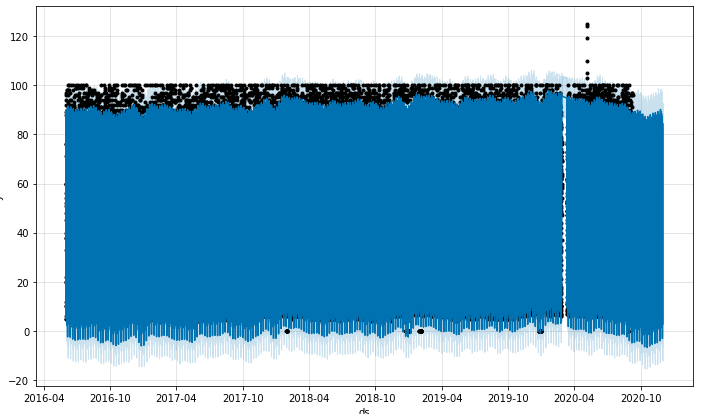

# Mod11_challenge - Mercado Libre Time Series Analysis

# Overview
MercadoLibre is the most popular e-commerce site in Latin America. This analysis looks at the company's financial and user data
to help the company grow. It is trying to predict search traffic stock trading patterns. It looks at time series data,
seasonality and forecasts with Prophet.

# Technical Details

This analysis was completed in Google colab at (https://colab.research.google.com/drive/1GGnkd03EA_a61udOBzKNBlTUDINFq_DM#scrollTo=-ncJFW68L5VQ)
This analysis MUST be run in Google colab
Requires Facebook Prophet

# Requires following libraries and imports
'''
!pip install pystan
!pip install fbprophet
!pip install hvplot
!pip install holoviews

# Import the required libraries and dependencies
import pandas as pd
import holoviews as hv
from fbprophet import Prophet
import hvplot.pandas
import datetime as dt
%matplotlib inline
numpy as np

'''

# Data
The data comes from two csv files called google_hourly_search_trends.csv and mercado_stock_price.csv stored in the Resources folder
You will be required in Google Colab to choose each of the files to upload them - find the files in the Resources section.

'''
Path("google_hourly_search_trends.csv")
Path("mercado_stock_price.csv")
'''

# Looked for patterns in search trends across time

# Looked at trends by the days of the week

# Looked at trends on a heatmap

# Looked at search trends by week of year

# Looked at close price over years

# Looked at close and search trends for the first half of 2020

# Looked at Stock Volatility

# Looked at forecast trends

# Looked at Predictions

# Looked at some component time series plots

# Did some correlations

# Creator
Ann Howell with support from Rice University FinTech Bootcamp

# License
MIT
